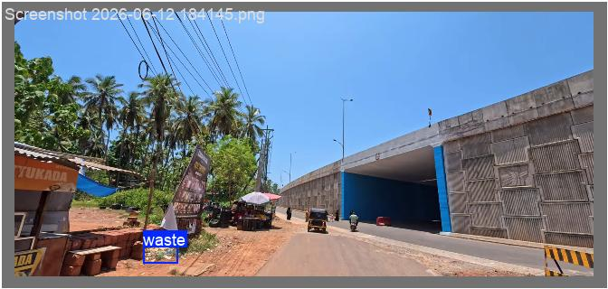

# Women Safety Drone Response System

Combined workspace for the women safety drone simulation and the evidence capture service.

<details open>
<summary><strong>Demo Screenshots & Videos</strong></summary>

### Screenshots

<table>
  <tr>
    <td align="center">
      
      <br />
      <sub>Drone asset used by the simulation UI</sub>
    </td>
    <td align="center">
      
      <br />
      <sub>Example detection / validation output</sub>
    </td>
  </tr>
</table>

### Video Demo

Add short demo videos here in `mp4` or `webm` format when available.

Suggested location:

- `./media/demo.mp4`
- `./media/sos-mode.webm`

</details>

## Repository Layout

```text
women-safety-drone-response-system/
├── sos-and-safe-walk-drone-simulation/
│   ├── src/                # React + TypeScript app source
│   ├── public/             # Static assets used by the frontend
│   ├── server.js           # Express server for production/runtime
│   ├── package.json        # Frontend/runtime scripts and dependencies
│   ├── 01_schema.sql       # Database schema for the simulation backend
│   ├── demo.sql            # Sample data for testing
│   └── vite.config.ts      # Vite build configuration
└── evidence-capture/
    ├── main.py             # FastAPI app for evidence upload and retrieval
    ├── uploader.py         # Cloudinary upload helper
    ├── hasher.py           # SHA-256 hashing helper
    ├── requirements.txt    # Python dependencies
    └── index.html          # Simple front-end / service page
```

## Folder Overview

### `sos-and-safe-walk-drone-simulation`

Main drone response demo application.

- `src/` contains the React UI, map logic, SOS flow, and Safe Walk flow.
- `public/` stores static assets such as the drone icon.
- `server.js` runs the Node/Express server used for the built app.
- `01_schema.sql` and `demo.sql` support the database-backed parts of the demo.
- `dist/` is the generated production build output.

### `evidence-capture`

FastAPI-based evidence capture service.

- `main.py` exposes the upload and retrieval endpoints.
- `uploader.py` handles Cloudinary uploads.
- `hasher.py` generates file hashes for uploaded evidence.
- `requirements.txt` lists the Python packages needed to run the service.
- `__pycache__/` is generated automatically by Python and can be ignored.

## Local Setup

### 1) Prerequisites

- Node.js 18+ and npm
- Python 3.10+
- PostgreSQL if you want the database-backed simulation features
- Cloudinary credentials if you want evidence uploads to work

### 2) Run the drone simulation app

```bash
cd sos-and-safe-walk-drone-simulation
npm install
```

For frontend development:

```bash
npm run dev
```

For the production-style server flow:

```bash
npm run build
npm start
```

The app is configured to run on `http://localhost:3000` when started through the Node server.

If you want database-backed routing or persistence, configure the database connection in the project environment before starting the server.
The server reads `DATABASE_URL` and optional `PORT` from the environment.

### 3) Run the evidence capture API

```bash
cd evidence-capture
python -m venv .venv
source .venv/bin/activate
pip install -r requirements.txt
uvicorn main:app --reload --host 0.0.0.0 --port 8000
```

If you are on Windows PowerShell, activate the virtual environment with:

```powershell
.venv\Scripts\Activate.ps1
```

### 4) Configure environment variables

The simulation project uses a `.env` file for runtime configuration, typically including `DATABASE_URL` and `PORT`.

For the evidence capture service, update the Cloudinary configuration in `evidence-capture/uploader.py` with your own credentials before deploying.

## Notes

- The simulation and evidence capture service are separate subprojects under this root folder.
- The screenshot/video block is kept near the top so it is visible in GitHub, while still remaining collapsible.
- Generated folders such as `dist/`, `node_modules/`, and `__pycache__/` are build/runtime artifacts.
