# Women Safety Drone Response System

Real-time women safety workspace built around three related demos: a city drone-response simulation, a stealth SOS system, and an evidence capture service. Together, they model patrol monitoring, silent emergency dispatch, Safe Walk escort flows, incident media capture, and cloud storage for later review.

## Summary

- Live drone-response simulation for monitoring patrol activity and city hotspots.
- Stealth SOS workflow for discreet emergency response and drone dispatch.
- Safe Walk escort flow for guided movement support in public spaces.
- Evidence capture service for uploading, hashing, and retrieving incident media and GPS metadata.
- Shared workspace that keeps the three demos organized in one repository.

## Repository Layout

```text
women-safety-drone-response-system/
├── sos-and-safe-walk-drone-simulation/
│   ├── src/                # React + TypeScript app source
│   ├── public/             # Static assets used by the frontend
│   ├── server.js           # Express server for production/runtime
│   ├── package.json        # Frontend/runtime scripts and dependencies
│   ├── 01_schema.sql       # Database schema for the simulation backend
│   ├── demo.sql            # Sample data for testing
│   └── vite.config.ts      # Vite build configuration
├── stealth-sos/
│   ├── backend/            # FastAPI + Socket.IO guardian drone backend
│   └── frontend/           # Vite + React stealth SOS interface
└── evidence-capture/
    ├── main.py             # FastAPI app for evidence upload and retrieval
    ├── uploader.py         # Cloudinary upload helper
    ├── hasher.py           # SHA-256 hashing helper
    ├── requirements.txt    # Python dependencies
    └── index.html          # Simple front-end / service page
```

## Folder Overview

### `sos-and-safe-walk-drone-simulation`

Main drone response demo application.

- `src/` contains the React UI, map logic, SOS flow, and Safe Walk flow.
- `public/` stores static assets such as the drone icon.
- `server.js` runs the Node/Express server used for the built app.
- `01_schema.sql` and `demo.sql` support the database-backed parts of the demo.
- `dist/` is the generated production build output.

### `stealth-sos`

Silent SOS demo with a separate backend/frontend split.

- `backend/` contains the FastAPI and Socket.IO service that dispatches the nearest drone.
- `frontend/` contains the Vite + React UI with shake and keyboard SOS detection.
- `backend/drone_controller.py` simulates the drone fleet and movement path.
- `frontend/src/components/` holds the map, detector, drone marker, and arrival controls.
- `frontend/.env` can point the UI at the local backend through `VITE_SOCKET_URL`.

### `evidence-capture`

FastAPI-based evidence capture service.

- `main.py` exposes the incident upload and lookup endpoints.
- `uploader.py` sends uploaded media to Cloudinary.
- `hasher.py` generates SHA-256 hashes for uploaded evidence.
- The API accepts video, audio, GPS data, and an `incident_id` per submission.
- `requirements.txt` lists the Python packages needed to run the service.
- `__pycache__/` is generated automatically by Python and can be ignored.
- `index.html` is the lightweight browser-facing UI for the evidence capture demo.

## Local Setup

### 1) Prerequisites

- Node.js 18+ and npm
- PostgreSQL if you want the database-backed simulation features
- Python 3.10+ for the stealth SOS backend and evidence capture service
- Cloudinary credentials if you want evidence uploads to work

### 2) Run the drone simulation app

```bash
cd sos-and-safe-walk-drone-simulation
npm install
```

For frontend development:

```bash
npm run dev
```

For the production-style server flow:

```bash
npm run build
npm start
```

The app is configured to run on `http://localhost:3000` when started through the Node server.

If you want database-backed routing or persistence, configure the database connection in the project environment before starting the server.
The server reads `DATABASE_URL` and optional `PORT` from the environment.

### 3) Run the stealth SOS demo

```bash
cd stealth-sos/backend
python -m venv venv
source venv/bin/activate
pip install -r requirements.txt
python main.py
```

In a second terminal:

```bash
cd stealth-sos/frontend
npm install
npm run dev
```

The backend runs on `http://localhost:8000` and the frontend runs on `http://localhost:5173`.

### 4) Run the evidence capture API

```bash
cd evidence-capture
python -m venv .venv
source .venv/bin/activate
pip install -r requirements.txt
uvicorn main:app --reload --host 0.0.0.0 --port 8000
```

If you are on Windows PowerShell, activate the virtual environment with:

```powershell
.venv\Scripts\Activate.ps1
```

### 5) Configure environment variables

The simulation project uses a `.env` file for runtime configuration, typically including `DATABASE_URL` and `PORT`.

For the stealth SOS frontend, set `frontend/.env` with `VITE_SOCKET_URL=http://localhost:8000` if you are not using the default backend URL.

For the evidence capture service, update the Cloudinary configuration in `evidence-capture/uploader.py` with your own credentials before deploying.

Note: both the `stealth-sos` backend and the `evidence-capture` API default to port `8000`. Run them separately or change one of the ports if you want both active at the same time.

## Screenshots

<details>
<summary><strong>Drone Simulation</strong></summary>

1. Operations deck overview

   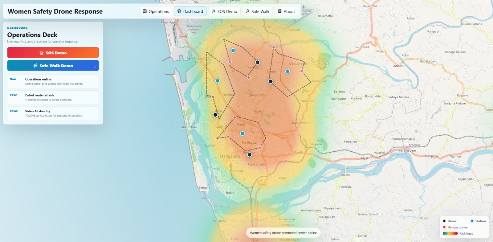

2. Dashboard status and active incidents

   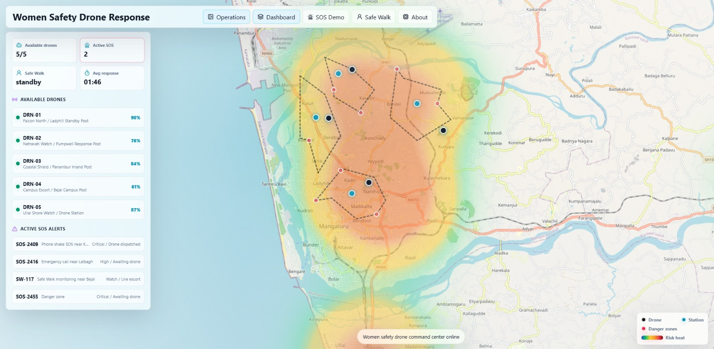

3. SOS dispatch in progress

   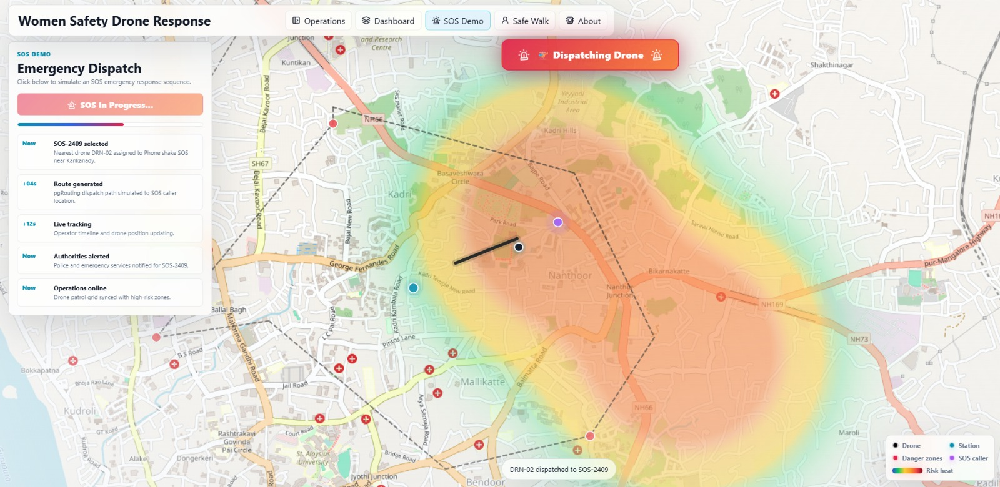

4. SOS arrival and audio recording

   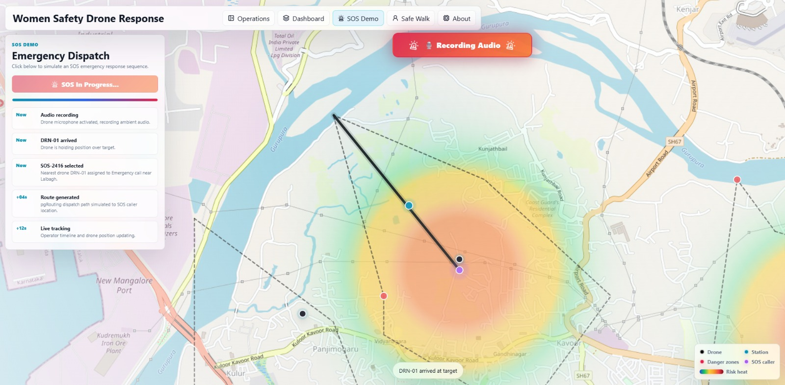

5. Safe Walk escort in progress

   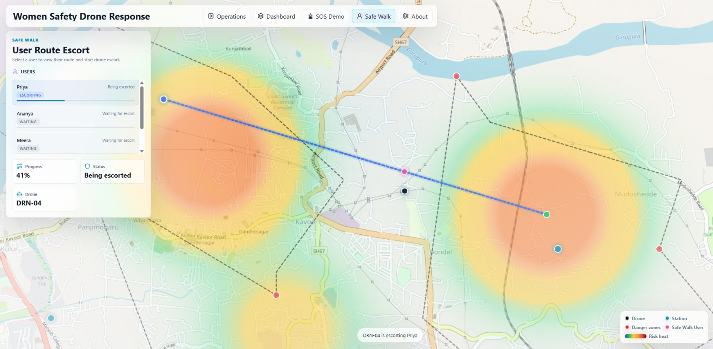

</details>

<details>
<summary><strong>Stealth SOS</strong></summary>

1. Stealth SOS landing screen

   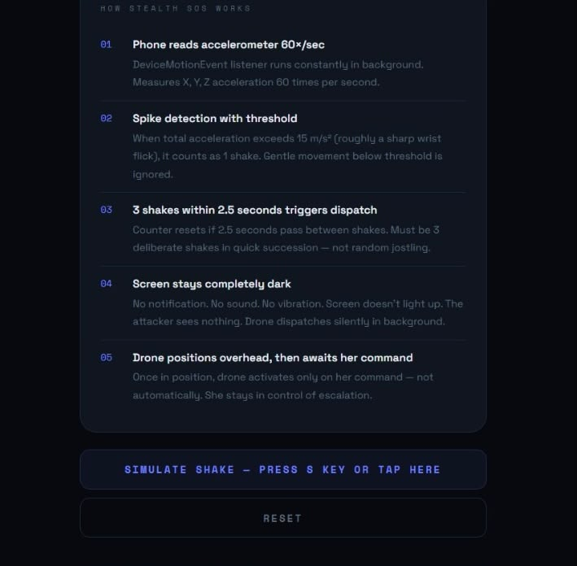

2. Stealth SOS motion trigger view

   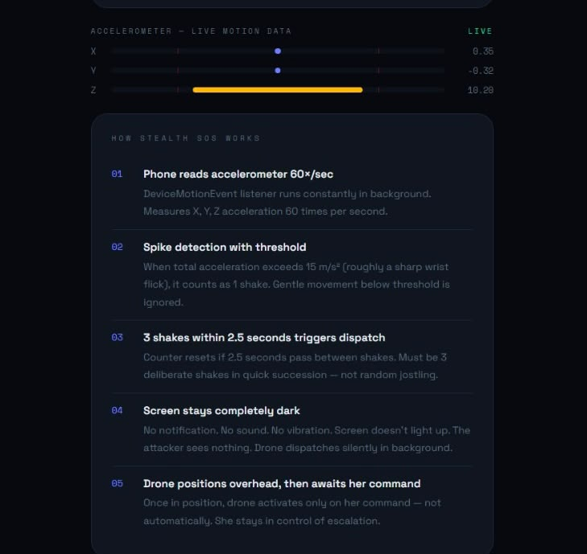

3. Stealth SOS trigger explanation screen

   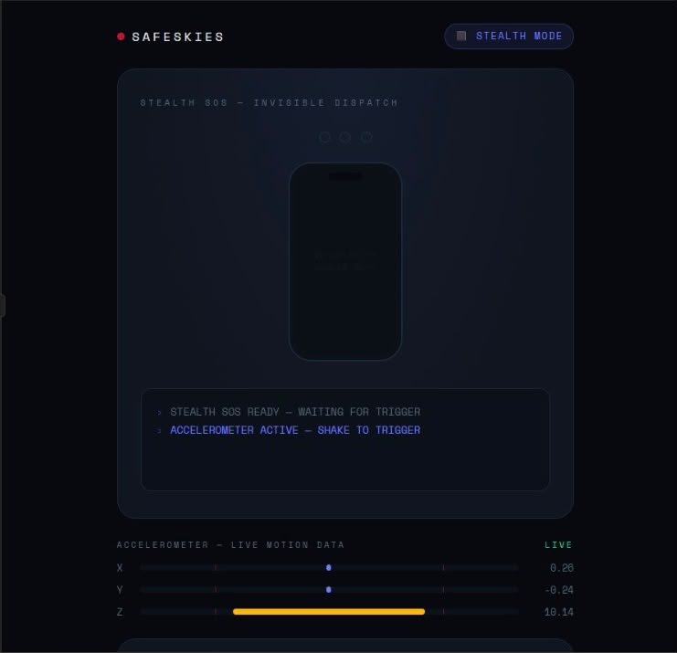

</details>

<details>
<summary><strong>Evidence Capture</strong></summary>

1. Evidence capture continued recording

   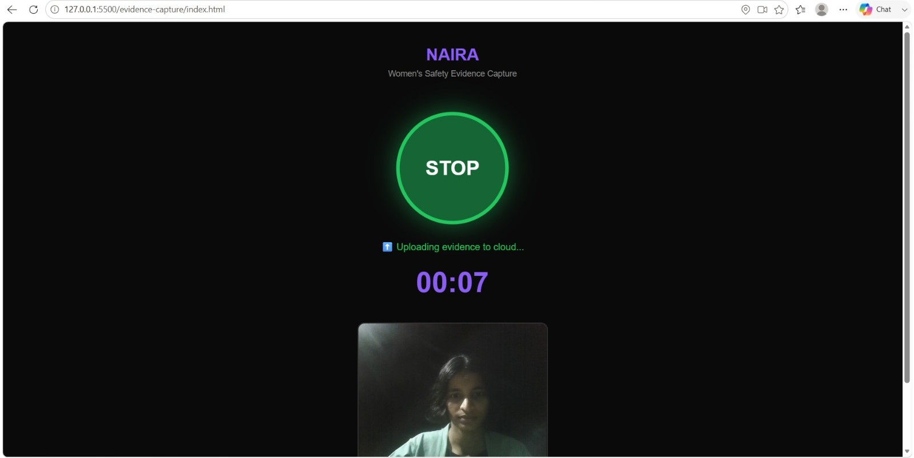

2. Evidence file list and stored uploads

   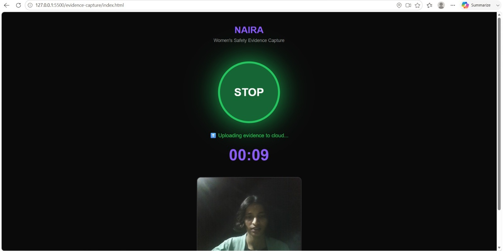

3. Evidence capture recording and saved entry

   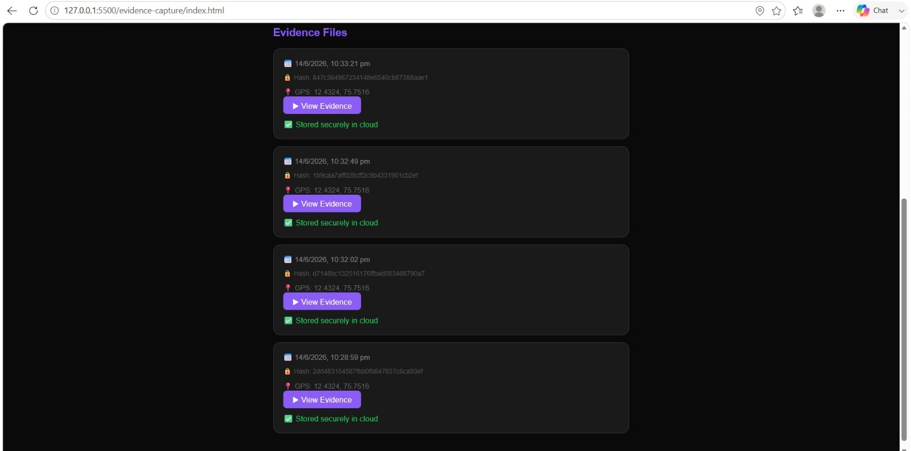

4. Evidence capture running with uploaded evidence visible

   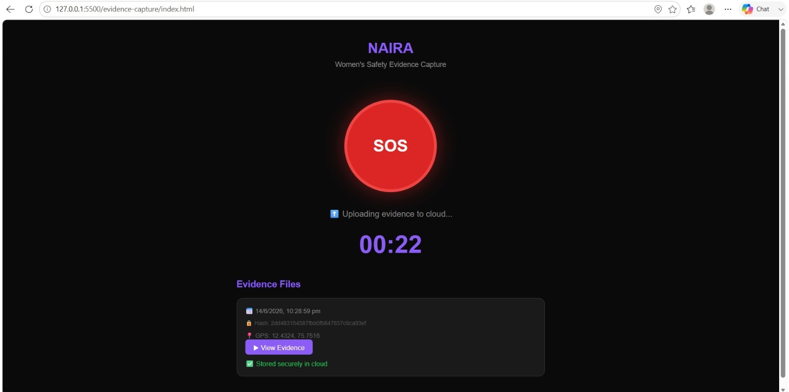

5. Cloudinary asset library view

   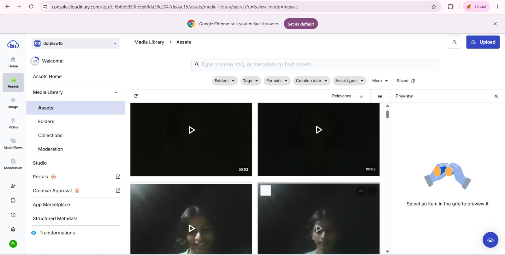

## Notes

- The simulation and evidence capture service are separate subprojects under this root folder.
- Generated folders such as `dist/`, `node_modules/`, and `__pycache__/` are build/runtime artifacts.
